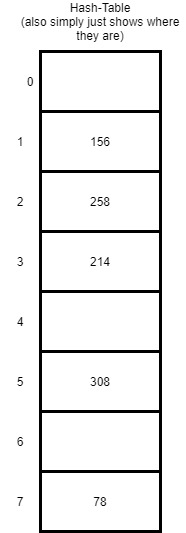
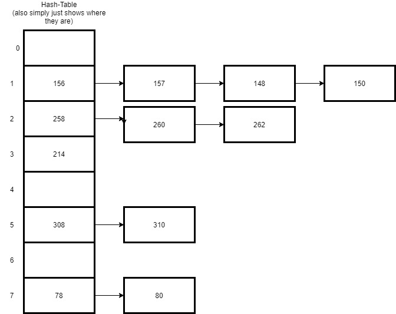

# Sets
## Big O values of a Set
- Searching a Set O(n)
- Inserting into a Set	O(n)		
- Deleting in a Set	O(n)	
# What is a Set?
What makes Sets interesting is their set of rules is unlike most others. They are Unordered and un-repeated. This leaves much room for efficiency when dealing  whether a specific element is contained in the set. Which is much harder in other data structures due to having to iterate through the whole data structure.

Because sets cannot have multiple occurrences of the same data, sets become highly useful to  remove duplicate values from a list or tuple and to do common math operations like unions and intersections. 

Lets actually start by looking at some code

```python
{
mylist = ["a", "b", "c"]
myset = set(["a", "b", "c"])
print(mylist)
print(myset)
  
# Adding element to the set
mylist.append("d")
myset.add("d")
print(mylist)
print(myset)
```

Well that was interesting! We can see by running this code that while a list appends to the end a set adds it in what we see as a randomized spot.

With Sets we use somehting that is called hashing to find the spot in which to add it. By using that hash it makes it very easy to find the data later.

>**hashing** Hashing is the transformation of a string of characters into a usually shorter fixed-length value or key that represents the original string.

But what happens with duplicate data?
Lets see!

```python
{
myset = set(["a", "b", "c","d"])
print(myset)
  
# Adding element to the set
#you see how its a duplicate?
myset.add("d")
#lets print it and see what happens
print(myset)
```


# Internal workings of Sets

As mentioned a bit earlier what makes sets so useful is their ability to organize large data in a way where you end up with no duplicates. If you did need to include duplicates of the same hash we would call that **chaining**

>**Chaining** - is a way to remove conflicts in a set where all the items that hash to the same index are chained together (in a linked list) into a single data structure index location. If you want to find that data later, the code will need to look theough the set first and than the linked list created.

 In order to better understand this lets look at a picture of a set



In this simple drawing we can see that it seems very random to us but is actually arranged by the hashes that organized these numbers. 

If we were to use chaining than our Set may look like this



Luckily for us Python is great at making sure that our sets are big enough to arrange our hashes very efficiently which really helps us with the common uses of Sets such as simple math operations.
Let us use a Set to do some simple math operations and see what happens!

A few of the common operations include
- **Union** You can use the union method to find out all the unique values in two sets.

- **Intersection** is is used to see all of the elements of A that also belong to B
- **Difference** A difference of two sets, is the set of all values of the one apllied at first that are not values of the second.

```python

Numbers = set([1, 3, 5, 6, 7, 8, 9, 10])
OtherNumbers = set([1, 3, 4, 6, 8, 11])
print("Union")
print(Numbers.union(OtherNumbers))
print("Intersection")
print(Numbers.intersection(OtherNumbers))
print("Difference")
print(Numbers.difference(OtherNumbers))

```

>Output
```python
Union
{1, 3, 4, 5, 6, 7, 8, 9, 10, 11}
intersection
{8, 1, 3, 6}
difference
{9, 10, 5, 7}
```
Interesting isnt it! Sets can be very useful when wanting to wuickly perform these kinds of operations. Take a second to look over what each of those do.

But what happends if we reverse which set came first? Lets look!

```python
Numbers = set([1, 3, 5, 6, 7, 8, 9, 10])
OtherNumbers = set([1, 3, 4, 6, 8, 11])
print("Union")
print(OtherNumbers.union(Numbers))
print("Intersection")
print(OtherNumbers.intersection(Numbers))
print("Difference")
print(OtherNumbers.difference(Numbers))
```

>output
```python
Union
{1, 3, 4, 5, 6, 7, 8, 9, 10, 11}
Intersection
{8, 1, 3, 6}
Difference
{11, 4}
```

Now that you know a bit more on how these Sets work lets have you try some problem solving!

## **Practice**
You have been put in charge of going through the companies data and seeing how many times each user has logged onto the server if they have only logged in once we must contact them!
They have provided you with 2 files.
-The first one **names.txt** is the list of all users who have accounts
-The second one **loggedin.txt** is a list of all those who have logged in

I will help you out by starting you out so just follow along.
```Python
#This is to open the file of names
a_file = open("names.txt", "r")

names = []
for line in a_file:
  stripped_line = line.strip()
  line_list = stripped_line.split()
  names.append(line_list)

a_file.close()

a_file = open("loggedin.txt", "r")

logged = []
for line in a_file:
  stripped_line = line.strip()
  line_list = stripped_line.split()
  logged.append(line_list)

a_file.close()
#This is the end of me creating LISTS from the files for you
```

Now we can see that this list is MASSIVE (its over 10,000 names) I have actually put some duplicates in here and trying to find them by hand would be a nightmare!

Luckily for us converting this into a set could help us!

How could you convert this into a set and than find any duplicates?

[ <font size="6"> Solution to Sets</font>](setssolution.py)