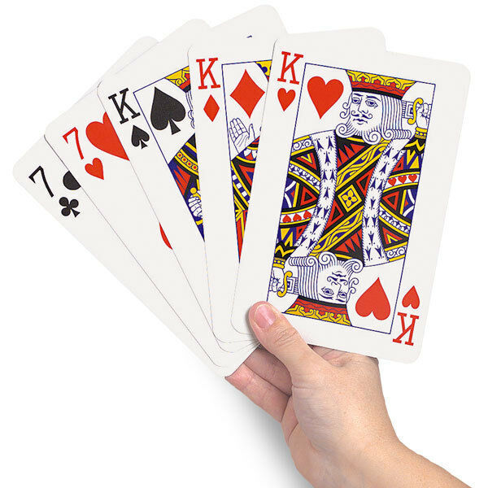

# Stacks
Like all data structures stacks follow a specific set of rules. So to bring a bit of abstraction to it stacks would be like a stack of pancakes

 
or a stack of cards. 
 

You see how the word stack is in those? It directly applies to the data structure Stack.
## The O() of stacks?
It is important as well to note that the usefulness of using a stack over other data types comes into the Big O() Notation I talked about earlier. WHen you want to add or take away from your data type a stack is nice and simple with an O(1).

## FIFO
 In our quest of a better understanding of how this structure works and to those in the restauraunt industry there is an easy way to remember it, which is FIFO(First in First out). This idea can be utilized in programming through functions that we call push and pop
## Push and Pop
Luckily for us push() and pop() are built in functions in python that we can use


`
push()
`
 – Adds the data within the parenthesis at the top of the stack – O(1)

 and 

`
pop()
`
 – Deletes the top most element of the stack – O(1) in nearly all cases this will end up being a .append() function


Lets use these in some code.
We are going to make a simple stack by using a list as our base and than we can use push and pop respectivley and see what it does

```python
{
#We must first create an empty list to add stuff to
Stack = []

#Lets add a, b, and c to our list and go from there
Stack.append('a')
Stack.append('b')
Stack.append('c')

Stack
#it now would look like this ['a', 'b', 'c']
```

So lets think about this for a second. We added A first followed by B than C these are all pushes into the stack we created. By appending them we add them to the end of the list

Insert photo here

This would mean that C would be at the top of our stack.
What would happen if we were to use the pop function?
```python
#We must first create an empty list to add stuff to
Stack = []

#Lets add a, b, and c to our list and go from there
Stack.append('a')
Stack.append('b')
Stack.append('c')

Stack
#it now would look like this ['a', 'b', 'c']

#what happens if we use pop()?
Stack.pop()
print Stack
#it now would look like this ['a', 'b']
```
Lets add to it though

```python
#We must first create an empty list to add stuff to
Stack = []

#Lets add a, b, and c to our list and go from there
#the append function is a push
Stack.append('a')
Stack.append('b')
Stack.append('c')

Stack
#it now would look like this ['a', 'b', 'c']

#what happens if we use pop()?
Stack.pop()
print Stack
#it now would look like this ['a', 'b']
Stack.append('d')
print (Stack)
```

You see?! When we really get down into it stacks are very simple but also very useful
 

# UNDO and REDO
I think a great example of a real world example of something that uses a stack is the UNDO and REDO functions in our computers. I think it would be smart of us to design our own UNDO and REDO buttons that utilize push and pop so we can easily prototype.

How would you do it? 

Here is a hint
>Break up what the user types into seperate words and convert it into a stack

[ <font size="6"> Solution to Stacks</font>](Solutions\stackssolution.py)